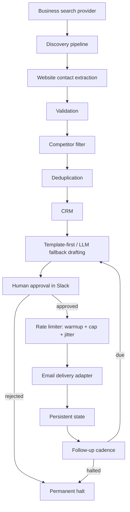

# B2B AI Operations & Outreach System

A sanitized, runnable Python reference implementation of a B2B lead-discovery and outreach-operations system: **discovery → contact extraction → validation → CRM → AI-assisted drafting → human approval → safety controls → dry-run delivery → follow-up state.**

> **Scope:** This is a public-safe reconstruction of a system derived from real production work, not the original production codebase. The public demo uses synthetic fixtures and mock integrations. It does not send real outreach. No client data, credentials, or production infrastructure are included.

## At a glance

- **Runnable offline:** `python demo.py` walks the workflow using mock integrations; no API keys or network access required.
- **Tested:** 29 tests cover core workflow behavior, failure cases, and persistence. Run with `python -m pytest -v`.
- **Operational controls:** explicit human approval before delivery, warm-up tiers, randomized daily caps, jitter, deduplication, and permanent halt behavior.
- **Production boundary:** the architecture and generalized engineering patterns are reconstructed; the public integrations and data are not production-connected.

## Architecture



The public implementation is code-first and has no user-facing UI. Full data-flow and approval-sequence diagrams are in [docs/architecture.md](docs/architecture.md).

## Workflow and engineering decisions

1. **Discover** businesses by region and segment, handling pagination rather than silently dropping later results.
2. **Extract and validate** contact emails from each business's own website (`mailto:` first, constrained fallback second). A regression test covers a previously fixed case where a phone number was glued directly to an email.
3. **Filter and deduplicate** against a competitor blocklist, CRM records, local state, and the current run.
4. **Create CRM records** for eligible leads.
5. **Draft** with templates first and an LLM fallback only when a segment has no template.
6. **Require human approval** through a chat reaction before any delivery attempt.
7. **Apply safety controls** including warm-up tiers, randomized daily caps, per-send jitter, and permanent halt on rejection or operator action.
8. **Deliver through an adapter.** In this public repository, delivery is dry-run only; it records the simulated send in persistent state and does not send email.
9. **Schedule follow-ups** from persisted state, excluding halted contacts.

The central design principle is that approval gates the external side effect; it does not merely audit it afterward. A rejection means permanent halt, not “skip this one and try again later.”

## Local demo

```bash
python -m venv .venv && source .venv/bin/activate   # .venv\Scripts\activate on Windows
pip install -r requirements.txt
python demo.py
```

The demo uses mocks and synthetic data. It requires no `.env`, API keys, or network access. See [docs/demo.md](docs/demo.md) for the walkthrough and [docs/safety-controls.md](docs/safety-controls.md) for the control model.

## Example output

```text
6. HUMAN APPROVAL (Slack reaction simulation)
  hello@northfield.example: approved
  office@harbortrade.example: approved
  info@bluepoint.example: rejected -> halted, will never re-enter cadence

7. SAFETY CHECKS + RATE LIMITER
  day 2 of operation -> warmup tier cap for today: 12 sends

8. CONTROLLED SEND
  hello@northfield.example: queued with 35min jitter -> DRY RUN (no real email sent)
  office@harbortrade.example: queued with 41min jitter -> DRY RUN (no real email sent)
```

## Testing

```bash
python -m pytest -v
```

The 29 tests cover rate-limiter tiers/caps/jitter, the email-extraction regression, competitor filtering, deduplication, halt/cadence rules, approval-state transitions, and state-store persistence/atomicity. Tests use mocks or fixtures; they do not make live API calls.

## Production lessons

The public repository includes generalized lessons from operating the source system, with client-identifying details omitted:

- Pagination that silently caps results can cause incomplete CRM syncs and duplicate processing.
- A failed API call and a valid empty result must remain distinguishable to callers.
- Search-space exhaustion can look like a slow system; partitioning by region and segment can be more effective than merely increasing page limits.
- A human rejection should halt future outreach, not trigger a differently worded retry.
- A daemon needs an explicit, checkable view of what is currently running, separate from what is present in the repository.
- `DRY_RUN` should be explicit at the delivery boundary, not hidden in a distant global flag.

Further detail: [docs/lessons-learned.md](docs/lessons-learned.md) and [docs/design-decisions.md](docs/design-decisions.md).

## Production vs. public-demo boundary

This repository is a sanitized reference implementation, not the production codebase:

- Credentials, board/channel IDs, infrastructure details, client records, logs, and deployment configuration are excluded.
- Integrations are represented by interfaces and mock implementations; the public delivery path is dry-run only.
- Business/segment/region names and example contacts are synthetic placeholders.
- The reconstructed business logic covers discovery orchestration, extraction, validation, deduplication, drafting, approval, rate limiting, cadence, and fault-isolated scheduling. The public repository does not connect to the original production environment.

## License

All rights reserved. See [LICENSE](LICENSE). Published for portfolio/reference purposes; not licensed for reuse.
