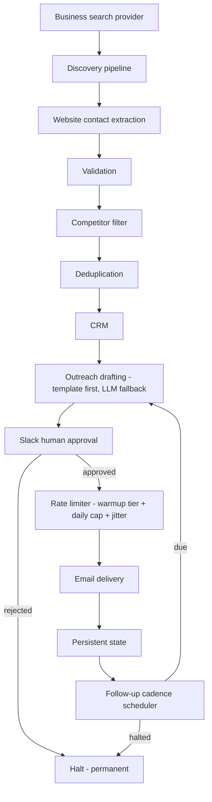

# B2B AI Operations & Outreach System

A sanitized, runnable reference implementation of an AI-assisted B2B lead
discovery and outreach system: **discovery → enrichment → CRM → AI drafting
→ human approval → safety controls → controlled sending → follow-up
state.**

This is derived from a real system I built and operated in production for
several months. This repository is not that system - it's a public-safe
reconstruction of its architecture and engineering patterns, with all
client-specific data, credentials, and infrastructure replaced by mocks and
synthetic fixtures. See [Production vs. public-demo boundary](#production-vs-public-demo-boundary)
below for exactly what that means.

## Why this exists

"Connect an LLM to an inbox" is not the hard part of B2B outreach
automation. The hard part is everything around it: finding real,
correctly-contactable businesses at a sustainable rate; not emailing the
same business twice; not emailing a competitor; not sending faster than a
new sending identity can sustain; and - most importantly - never letting an
AI-generated action reach a real inbox without a person explicitly signing
off on it first.

This project is the answer to "what does it take to run that safely,
unattended, for months, without an incident."

## Architecture



Full data-flow and approval-sequence diagrams: [docs/architecture.md](docs/architecture.md).

## Key capabilities

- **Lead discovery** across multiple regions and customer segments, with
  pagination handling that doesn't silently drop results past the first page.
- **Contact extraction** from a business's own website - preferring a
  published `mailto:` link, falling back to a domain-restricted text scan
  that specifically recovers from a phone number glued directly against an
  email with no separator (a real, previously-fixed bug - see
  [tests/test_email_extraction.py](tests/test_email_extraction.py)).
- **CRM integration** - lead discovery writes into an actual CRM record,
  it isn't an isolated scraper with a spreadsheet on the side.
- **AI-assisted drafting** - templates first, LLM fallback only when a
  segment has no template.
- **Human-in-the-loop approval** via a chat reaction, not a bespoke UI.
- **Rate limiting** - warmup tiers, a randomized (not fixed) daily cap, and
  per-send jitter.
- **Persistent, crash-safe state** - approval state, send history, and
  halt status survive a process restart.
- **Follow-up cadence** across multiple stages, with permanent halt on
  rejection or explicit operator action.
- **Deduplication** against CRM records, local state, and the current
  discovery run simultaneously.
- **Competitor filtering** before a lead ever reaches drafting.
- **Fault-isolated background scheduling** - one job's exception can't take
  down the others.

## How the workflow works

1. **Discovery** searches each region x segment combination against a
   business-search provider and pulls each result's own website.
2. **Extraction** pulls a contact email off that website - `mailto:` first,
   then a constrained regex fallback.
3. **Validation** drops anything that isn't a plausible, non-role email.
4. **Competitor filtering** drops anything matching a known-competitor
   blocklist.
5. **Deduplication** drops anything already in the CRM, already in local
   state, or already seen earlier in the same run.
6. **CRM** gets a new record for what's left.
7. **Drafting** produces a subject + body - template-first, LLM fallback.
8. **Approval** posts the draft to a chat channel; a human reacts to
   approve or reject.
9. **Safety checks + rate limiter** confirm today's send cap hasn't been
   reached and apply a send-time jitter.
10. **Delivery** sends (or, in this repo, dry-runs) the email and records
    the send in state.
11. **Follow-up** cadence checks state on a schedule and queues the next
    stage's draft when it's due - unless the contact has been halted.

## Human-in-the-loop design

An AI-drafted email is not allowed to cause an external side effect on its
own. The draft is posted to a chat channel; a checkmark reaction approves
it, a cross rejects it. Rejection isn't "skip this one" - it halts the
contact permanently, so a human's "no" can't be silently overridden by the
next scheduled cadence stage. This is the actual point of the whole
architecture: the interesting engineering problem was never generating the
email, it was controlling what happens after.

## Safety controls

- **Validation** - reject malformed or role-address contacts before they're
  actionable.
- **Competitor filtering** - a plain, auditable substring blocklist.
- **Deduplication** - checked against CRM + local state + the current run.
- **Approval gating** - nothing sends without an explicit human approval.
- **Rate limiting** - warmup tiers, randomized daily caps, send jitter.
- **Retries / fault isolation** - one background job's failure can't stop
  the others.
- **State persistence** - crash-safe (temp-file-then-move) writes; approval,
  send history, and halt status all survive a restart.
- **Halt behavior** - permanent removal from all future outreach.

Full writeup: [docs/safety-controls.md](docs/safety-controls.md).

## Local demo

```bash
python -m venv .venv && source .venv/bin/activate   # .venv\Scripts\activate on Windows
pip install -r requirements.txt
python demo.py
```

No API keys or `.env` required - everything runs against mock integrations.
Full walkthrough: [docs/demo.md](docs/demo.md).

## Example output

```
----------------------------------------------------------------------
6. HUMAN APPROVAL (Slack reaction simulation)
----------------------------------------------------------------------
  hello@northfield.example: approved
  office@harbortrade.example: approved
  info@bluepoint.example: rejected  -> halted, will never re-enter cadence

----------------------------------------------------------------------
7. SAFETY CHECKS + RATE LIMITER
----------------------------------------------------------------------
  day 2 of operation -> warmup tier cap for today: 12 sends

----------------------------------------------------------------------
8. CONTROLLED SEND
----------------------------------------------------------------------
  hello@northfield.example: queued with 35min jitter -> DRY RUN (no real email sent)
  office@harbortrade.example: queued with 41min jitter -> DRY RUN (no real email sent)
```

Full output: run `python demo.py`, or see [docs/demo.md](docs/demo.md).

## Testing

```bash
python -m pytest -v
```

29 tests covering: rate-limiter tier/cap/jitter behavior, the
email-extraction regression (the glued phone/email bug), competitor
filtering, deduplication, halt/cadence rules, approval-flow state
transitions, and state-store persistence/atomicity. Every test runs against
mocks or fixtures - no live API calls, no network access required.

## Production lessons / engineering decisions

Selected, generalized lessons from operating the real system this is
derived from (client-identifying specifics deliberately omitted):

- **Pagination that silently caps results is worse than an API that
  errors** - a CRM sync that only read the first page believed a board was
  smaller than it was, and re-processed contacts that were already present.
- **Silent search-space exhaustion looks like "it's working, just
  slower"** - a discovery search too broad to find new results within its
  page limit doesn't error, it just quietly yields less over time. Fixed by
  narrowing the search space (region x segment) rather than widening the
  page limit.
- **A failed API call and an empty result must never look the same to
  calling code** - otherwise retry logic and write logic both make the
  wrong call.
- **Human approval has to gate the side effect, not audit it afterward** -
  only works if reversal is free, and an outbound email isn't reversible.
- **A rejection should mean "stop," not "skip once"** - the default for a
  human saying no should be permanent halt, not a retry with different
  wording.
- **A background daemon needs an explicit, checkable "what's running right
  now"** separate from what's in the repo - deploys can go silently stale.
- **`DRY_RUN` belongs in the function signature, not a global flag buried
  downstream** - so no caller can forget to check it.

Full writeup, with more detail on each: [docs/lessons-learned.md](docs/lessons-learned.md).
Design rationale for specific choices (why templates-first, why a flat-file
state store, why a blocklist over fuzzy matching): [docs/design-decisions.md](docs/design-decisions.md).

## Production vs. public-demo boundary

This repository is a sanitized reference implementation, not the production
codebase. What changed going from production to public:

- All credentials, board/channel IDs, and infrastructure details were
  removed - every integration is an interface plus a mock (see
  `src/integrations/`), driven by `.env.example` placeholders.
- All client data - contacts, CRM records, logs, deployment configuration -
  was excluded entirely, not merely redacted.
- Business/segment/region names are generic placeholders, not the real
  operator's industry or client.
- The business logic - discovery orchestration, extraction, validation,
  deduplication, drafting, approval flow, rate limiting, cadence, and
  fault-isolated scheduling - is the same reconstructed logic that actually
  ran in production, ported to synthetic fixtures. The architecture and the
  failure modes documented above are real; the data and infrastructure
  around them are not.

## 🎥 Engineering walkthrough

_A 2-3 minute walkthrough covering the architecture, the approval/rate-limit
implementation, and a live run of the demo will be linked here._

## License

All rights reserved - see [LICENSE](LICENSE). Published for portfolio/
reference purposes; not licensed for reuse.
