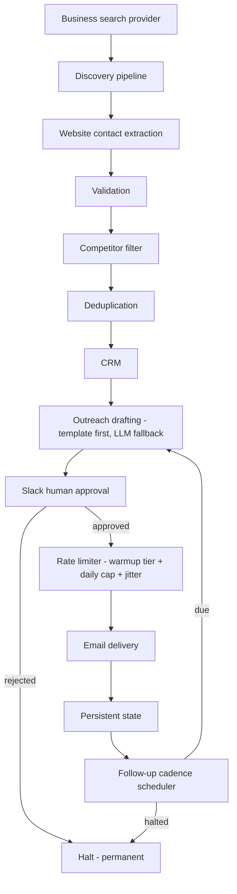
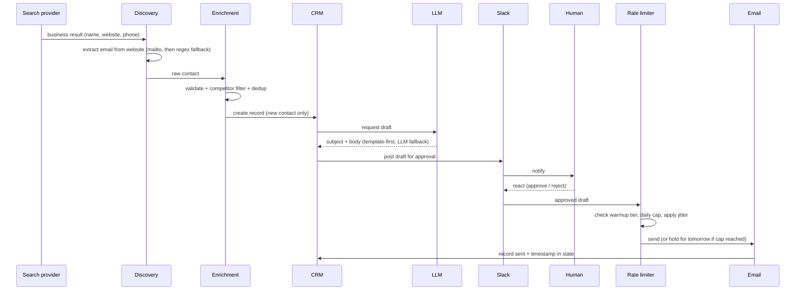
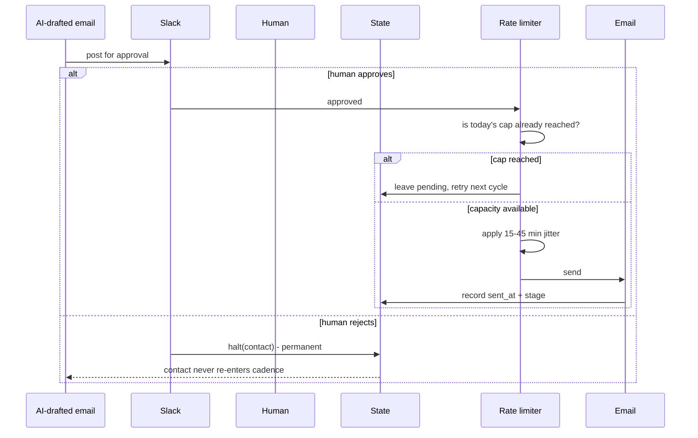

# Architecture

## System overview

## Data flow: lead to sent email

## Approval / send sequence (the safety-critical path)

## Why this shape

The pipeline is linear on the happy path, but every stage that could produce
a false positive (a bad email, a competitor, a duplicate) sits *before* the
CRM write, and every stage that produces an external side effect (an actual
send) sits *after* a human approval and a rate-limit check. That ordering is
the whole design: cheap-to-reverse mistakes (a bad CRM record) are filtered
early; expensive-to-reverse mistakes (an email that already left the
building) are gated behind the two slowest, most deliberate steps in the
system.

## Module map

| Concern | Module |
|---|---|
| Lead discovery | `src/discovery/pipeline.py` |
| Contact extraction | `src/discovery/contact_extractor.py` |
| Validation | `src/enrichment/validators.py` |
| Competitor filtering | `src/enrichment/competitor_filter.py` |
| Deduplication | `src/enrichment/dedup.py` |
| CRM adapter | `src/integrations/crm_client.py` |
| Drafting | `src/outreach/drafting.py`, `src/outreach/templates.py` |
| LLM adapter | `src/integrations/llm_client.py` |
| Human approval | `src/approval/approval_flow.py` |
| Slack adapter | `src/integrations/slack_client.py` |
| Rate limiting | `src/rate_limiter/limiter.py` |
| Email adapter | `src/integrations/email_client.py` |
| Persistent state | `src/state/store.py` |
| Follow-up cadence | `src/cadence/followup_scheduler.py` |
| Background scheduling | `src/scheduler/job_runner.py` |
